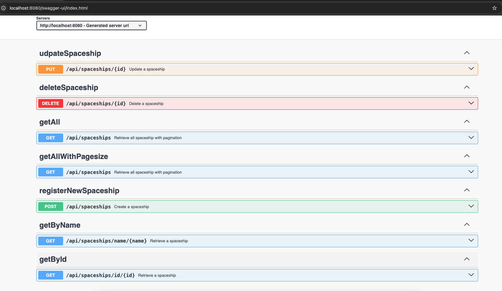

## Spring-Boot API Rest
### api-spaceships
#### by Mauricio Gonzalez

### Requirements
for building and running the application you need:

jdk 21
Maven 3
Docker(optional)

### Running the application locally
Maybe there are several ways to run an application but for this example it will be only 3 options:

#### Option 1: Command line
###### mvn clean install
###### mvn spring-boot:run

#### Option 2: Command line-execute jar
###### mvn clean install
###### java -jar target/spaceship-api.jar

#### Option 3: Docker (optional)
###### mvn clean install
###### docker image build -t api-spaceships:1.0.0 .
###### docker compose up -d

### After running
the endpoints will be;
http://localhost:8080/api/spaceships

#Security example
user admin, password starlord can CRUD

user groot, password iamgroot can CRU

#### API Documentation is available in:
###### http://localhost:8080/swagger-ui/index.html

